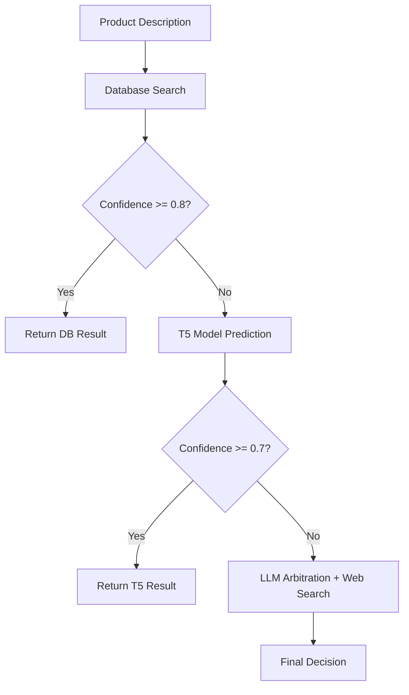

# Product Classification API - Agentic Architecture

[](https://python.org)
[](https://fastapi.tiangolo.com/)
[](https://langchain-ai.github.io/langgraph/)
[](https://docker.com)

## Overview

Système de classification automatique de produits utilisant une architecture agentic multi-étapes avec LangGraph. Le système optimise les coûts et la précision en routant intelligemment les requêtes à travers trois niveaux :

1. **Base de données** - Recherche de similarité rapide
2. **Modèle T5 local** - Classification par IA locale 
3. **LLM (GPT)** - Arbitrage final avec recherche web

## Architecture



## Features

- **Architecture Agentic** avec LangGraph pour orchestration intelligente
- **Classification multi-langue** (français, anglais, italien, espagnol, allemand)
- **Optimisation coût/précision** via seuils configurables
- **Évaluation complète** avec métriques détaillées par étape
- **API REST** avec FastAPI
- **Containerisation** Docker complète
- **Monitoring des coûts** en temps réel

## Quick Start

### Prerequisites
```bash
- Docker & Docker Compose
- Python 3.11+ (pour développement local)
- Clés API : OpenAI, Tavily, Hugging Face
```

### Setup
1. **Cloner le repository**
```bash
git clone <your-repo-url>
cd produc_match_new_api
```

2. **Configurer les variables d'environnement**
```bash
cp .env.example .env
# Éditer .env avec vos clés API
```

3. **Lancer avec Docker**
```bash
docker compose up --build
```

L'API sera disponible sur `http://localhost:8000`

## Configuration

### Variables d'environnement (.env)
```env
OPENAI_API_KEY=your_openai_key_here
TAVILY_API_KEY=your_tavily_key_here
HUGGINGFACE_TOKEN=your_hf_token_here
```

### Seuils de confiance (config.py)
```python
THRESHOLD_DATABASE = 0.8  # Seuil pour arrêt à la DB
THRESHOLD_T5_CONF = 0.7   # Seuil pour arrêt au T5
```

## API Usage

### Classification simple
```bash
curl -X POST "http://localhost:8000/classify" \
  -H "Content-Type: application/json" \
  -d '{"designation": "Emmental râpé 200g", "product_id": "FR001"}'
```

### Response
```json
{
  "final_label": "emmental rape",
  "confidence": 0.94,
  "database_confidence": 0.94,
  "database_prediction": "emmental rape",
  "t5_confidence": null,
  "t5_prediction": null,
  "path_taken": ["db_match_found"],
  "processing_time_ms": 156.2,
  "cost_usd": 0.0
}
```

### Classification batch
```bash
curl -X POST "http://localhost:8000/classify/batch" \
  -H "Content-Type: application/json" \
  -d '{"products": [{"designation": "Produit 1"}, {"designation": "Produit 2"}]}'
```

## Evaluation and Testing

### Tests complets
```bash
# Test français (150 produits)
python evaluation_test_french.py

# Test multilingue (150 produits)
python evaluation_test_multilingual.py
```

### Métriques collectées
- Précision par étape (DB, T5, LLM)
- Temps de traitement
- Coûts par requête
- Distribution des décisions
- Performance par catégorie/langue

## Performance Analysis

Le système génère des CSVs détaillés avec :
```csv
product_id,predicted_label,expected_label,is_correct,confidence,
database_confidence,database_prediction,
t5_confidence,t5_prediction,
decision_node,processing_time_ms,cost_usd
```

## Logging et Debug

### Configuration du logging des prompts LLM

Le système offre un logging détaillé des prompts envoyés au LLM pour faciliter le debug et l'optimisation :

```bash
# Dans votre .env
ENABLE_LLM_PROMPT_LOGGING=true         # Active/désactive le logging des prompts
MAX_PROMPT_LOG_LENGTH=2000            # Longueur max des prompts loggés (tronqués au-delà)
LLM_PROMPT_LOG_LEVEL=INFO             # Niveau de log (INFO, DEBUG, WARNING)
```

### Exemple de logs générés

```
================================================================================
PROMPT LLM - INITIAL - 2024-02-04 15:30:25
Contexte: Description: Fromage emmental râpé sachet 200g...
================================================================================

MESSAGE 1 - TYPE: SYSTEMMESSAGE
--------------------------------------------------
### RÔLE
Tu es un expert en Normalisation de Données Logistiques. Ta mission est de convertir une description brute en un "nature_product" (nom canonique français).

### LOGIQUE DE DÉCISION RENFORCÉE
1. **TOUJOURS VÉRIFIER LA BASE** : Utilise obligatoirement 'search_product_candidates' pour voir les candidats existants.
...

MESSAGE 2 - TYPE: HUMANMESSAGE
--------------------------------------------------
Description brute: Fromage emmental râpé sachet 200g
Prédiction T5: emmental rape (Confiance: 0.85)
Suggestions API externes: []

================================================================================

RÉPONSE FINALE LLM: emmental rape
COÛT: $0.000123 (Input: 245, Output: 12)
```

### Contrôle du niveau de logging

```python
# Dans le code, vous pouvez contrôler le logging par instance
from services.llm_service import OrchestratorService

# Désactiver le logging pour cette instance
orchestrator = OrchestratorService(enable_prompt_logging=False)

# Ou utiliser la configuration par défaut du .env
orchestrator = OrchestratorService()
```

### Logs de performance

Chaque appel génère également des logs de coût détaillés :
```
Coût GPT-5-nano: $0.000123
   • Input: 245 tokens ($0.000012)
   • Cached: 0 tokens ($0.000000)
   • Output: 12 tokens ($0.000048)
```

## Project Structure

```
produc_match_new_api/
├── agent/                      # Architecture LangGraph
│   ├── graph.py               # Workflow orchestration
│   ├── nodes.py               # Nœuds de traitement
│   └── state.py               # État partagé
├── services/                   # Services métier
│   ├── database_service.py    # Recherche DB
│   ├── t5_service.py          # Modèle local
│   └── llm_service.py         # Service LLM
├── evaluation_test_*.py       # Scripts d'évaluation
├── main.py                    # API FastAPI
├── config.py                  # Configuration
├── docker-compose.yml         # Container orchestration
└── requirements.txt           # Dépendances Python
```

## Supported Categories

### Product Types
- **Alimentaire** : Fromages, charcuterie, poissons, viandes
- **Boissons** : Bières, vins, spiritueux, champagnes  
- **Entretien** : Produits de nettoyage, désinfectants
- **Équipement** : Matériel de cuisine professionnel

### Supported Languages
- Français
- Anglais  
- Italien
- Espagnol
- Allemand

## Threshold Optimization

Utilisez les données d'évaluation pour optimiser :

```python
# Analyse coût/précision
import pandas as pd
df = pd.read_csv('evaluation_results.csv')

# Performance par seuil
for threshold in [0.7, 0.8, 0.9]:
    db_stopped = df[df['database_confidence'] >= threshold]
    accuracy = (db_stopped['database_prediction'] == db_stopped['expected_label']).mean()
    cost_saved = df[df['database_confidence'] < threshold]['cost_usd'].sum()
    print(f"Seuil {threshold}: Précision={accuracy:.3f}, Économie=${cost_saved:.4f}")
```

## Deployment

### Production avec Docker
```bash
# Build optimisé
docker build -t product-classifier:prod .

# Run avec ressources limitées  
docker run -p 8000:8000 \
  --env-file .env \
  --memory=2g \
  --cpus=1.5 \
  product-classifier:prod
```

### Scaling horizontal
```yaml
# docker-compose.prod.yml
version: '3.8'
services:
  app:
    image: product-classifier:prod
    replicas: 3
    deploy:
      resources:
        limits:
          memory: 2G
          cpus: '1.5'
```

## Contributing

1. Fork le projet
2. Créer une branche feature (`git checkout -b feature/amélioration`)
3. Commit vos changements (`git commit -am 'Ajout fonctionnalité'`)
4. Push la branche (`git push origin feature/amélioration`)
5. Ouvrir une Pull Request

## License

Ce projet est sous licence MIT - voir le fichier [LICENSE](LICENSE) pour les détails.

## Authors

- **Votre Nom** - *Développement initial* - [@votre-github](https://github.com/votre-github)

## Support

Pour toute question ou problème :
- **Issues** : [GitHub Issues](https://github.com/votre-repo/issues)
- **Email** : votre-email@exemple.com
- **Discord** : [Lien du serveur](https://discord.gg/votre-serveur)

---

**N'hésitez pas à mettre une étoile si ce projet vous est utile !**