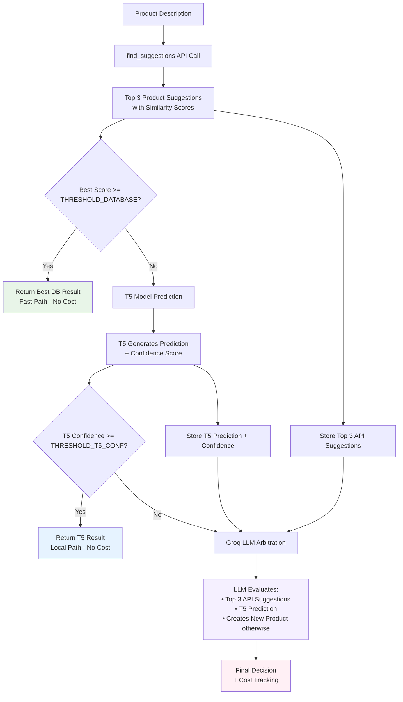

# Product Classification API - Agentic Architecture

[](https://python.org)
[](https://fastapi.tiangolo.com/)
[](https://langchain-ai.github.io/langgraph/)
[](https://docker.com)

## Overview

Automatic product classification system using a multi-stage agent architecture with LangGraph. The system optimizes costs and accuracy by intelligently routing requests through three levels:

1. **Database** - Fast similarity search
2. **Local T5 Model** - Local AI classification
3. **LLM (GPT)** - Final arbitration with web search

## Architecture



## Features

- **Agent Architecture** with LangGraph for intelligent orchestration
- **Multi-language classification** (French, English, Italian, Spanish, German)
- **Cost/accuracy optimization** via configurable thresholds
- **Complete evaluation** with detailed metrics per stage
- **REST API** with FastAPI
- **Complete containerization** with Docker
- **Real-time cost monitoring**

## Quick Start

### Prerequisites
```bash
- Docker & Docker Compose
- Python 3.11+ (for local development)
- API Keys: OpenAI, Tavily, Hugging Face
```

### Setup
1. **Clone the repository**
```bash
git clone <your-repo-url>
cd produc_match_new_api
```

2. **Configure environment variables**
```bash
cp .env.example .env
# Edit .env with your API keys
```

3. **Launch with Docker**
```bash
docker compose up --build
```

The API will be available at `http://localhost:8000`

## Configuration

### Environment variables (.env)
```env
OPENAI_API_KEY=your_openai_key_here
TAVILY_API_KEY=your_tavily_key_here
HUGGINGFACE_TOKEN=your_hf_token_here
```

### Confidence thresholds (config.py)
```python
THRESHOLD_DATABASE = 0.95  # Threshold for DB stop
THRESHOLD_T5_CONF = 0.94   # Threshold for T5 stop
```

## API Usage

### Simple classification
```bash
curl -X POST "http://localhost:8000/classify" \
  -H "Content-Type: application/json" \
  -d '{"designation": "Emmental râpé 200g", "product_id": "FR001"}'
```

### Response
```json
{
  "final_label": "emmental rape",
  "confidence": 0.94,
  "database_confidence": 0.94,
  "database_prediction": "emmental rape",
  "t5_confidence": null,
  "t5_prediction": null,
  "path_taken": ["db_match_found"],
  "processing_time_ms": 156.2,
  "cost_usd": 0.0
}
```

### Batch classification
```bash
curl -X POST "http://localhost:8000/classify/batch" \
  -H "Content-Type: application/json" \
  -d '{"products": [{"designation": "Produit 1"}, {"designation": "Produit 2"}]}'
```

## Evaluation and Testing

### Complete tests
```bash
# French test (150 products)
python evaluation_test_french.py

# Multilingual test (150 products)
python evaluation_test_multilingual.py
```

### Collected metrics
- Accuracy per stage (DB, T5, LLM)
- Processing time
- Cost per request
- Decision distribution
- Performance by category/language

## Performance Analysis

The system generates detailed CSVs with:
```csv
product_id,predicted_label,expected_label,is_correct,confidence,
database_confidence,database_prediction,
t5_confidence,t5_prediction,
decision_node,processing_time_ms,cost_usd
```

## Logging and Debug

### LLM prompt logging configuration

The system offers detailed logging of prompts sent to the LLM to facilitate debugging and optimization:

```bash
# In your .env
ENABLE_LLM_PROMPT_LOGGING=true         # Enable/disable prompt logging
MAX_PROMPT_LOG_LENGTH=2000            # Max length of logged prompts (truncated beyond)
LLM_PROMPT_LOG_LEVEL=INFO             # Log level (INFO, DEBUG, WARNING)
```

### Example generated logs

```
================================================================================
PROMPT LLM - INITIAL - 2024-02-04 15:30:25
Contexte: Description: Fromage emmental râpé sachet 200g...
================================================================================

MESSAGE 1 - TYPE: SYSTEMMESSAGE
--------------------------------------------------
### RÔLE
Tu es un expert en Normalisation de Données Logistiques. Ta mission est de convertir une description brute en un "nature_product" (nom canonique français).

### LOGIQUE DE DÉCISION RENFORCÉE
1. **TOUJOURS VÉRIFIER LA BASE** : Utilise obligatoirement 'search_product_candidates' pour voir les candidats existants.
...

MESSAGE 2 - TYPE: HUMANMESSAGE
--------------------------------------------------
Description brute: Fromage emmental râpé sachet 200g
Prédiction T5: emmental rape (Confiance: 0.85)
Suggestions API externes: []

================================================================================

RÉPONSE FINALE LLM: emmental rape
COÛT: $0.000123 (Input: 245, Output: 12)
```

### Logging level control

```python
# In code, you can control logging per instance
from services.llm_service import OrchestratorService

# Disable logging for this instance
orchestrator = OrchestratorService(enable_prompt_logging=False)

# Or use default .env configuration
orchestrator = OrchestratorService()
```

### Performance logs

Each call also generates detailed cost logs:
```
Coût GPT-5-nano: $0.000123
   • Input: 245 tokens ($0.000012)
   • Cached: 0 tokens ($0.000000)
   • Output: 12 tokens ($0.000048)
```

## Project Structure

```
produc_match_new_api/
├── .env                        # Environment variables
├── .env.example               # Example environment file
├── .gitignore                 # Git ignore rules
├── .dockerignore              # Docker ignore rules
├── README.md                  # Project documentation
├── requirements.txt           # Python dependencies
├── Dockerfile                 # Docker container definition
├── docker-compose.yml         # Docker orchestration
├── config.py                  # Configuration settings
├── main.py                    # FastAPI application entry point
├── performance_monitor.py     # Performance monitoring utilities
├── results.py                 # Results processing utilities
├── inferencet5.ipynb         # T5 model inference notebook
├── labeled_products_filtered.csv  # Filtered product dataset
├── classification_dashboard.html  # Web dashboard for results
│
├── agent/                     # LangGraph Architecture
│   ├── graph.py              # Workflow orchestration
│   ├── nodes.py              # Processing nodes
│   └── state.py              # Shared state definition
│
├── services/                  # Business services
│   ├── database_service.py   # External API integration
│   ├── t5_service.py         # Local T5 model service
│   └── llm_service.py        # Groq LLM service
│
├── evaluation/                # Evaluation scripts
│   ├── evaluation_test_french.py      # French language tests
│   ├── evaluation_test_multilingual.py # Multi-language tests
│   └── evaluation_test_real_data.py   # Real data evaluation
│
├── data/                      # Dataset files
│   ├── labeled_products.csv  # Original labeled dataset
│   ├── nature_product.csv    # Product nature mapping
│   └── validation_set.csv    # Validation dataset
│
├── utils/                     # Utility functions
│   └── filter_labeled_products.py  # Data preprocessing
│
├── checkpoint-11004/          # T5 model checkpoint
│   ├── adapter_config.json   # LoRA adapter configuration
│   ├── adapter_model.safetensors  # Model weights
│   ├── tokenizer.json        # Tokenizer definition
│   └── ...                   # Other model files
│
├── logs/                      # Application logs
├── models/                    # Model artifacts
├── __pycache__/              # Python cache files
```

## Supported Categories

### Product Types
- **Food** : Cheeses, charcuterie, fish, meat
- **Beverages** : Beers, wines, spirits, champagnes
- **Cleaning** : Cleaning products, disinfectants
- **Equipment** : Professional kitchen equipment

### Supported Languages
- French
- English
- Italian
- Spanish
- German

## Threshold Optimization

Use evaluation data to optimize:

```python
# Cost/accuracy analysis
import pandas as pd
df = pd.read_csv('evaluation_results.csv')

# Performance by threshold
for threshold in [0.7, 0.8, 0.9]:
    db_stopped = df[df['database_confidence'] >= threshold]
    accuracy = (db_stopped['database_prediction'] == db_stopped['expected_label']).mean()
    cost_saved = df[df['database_confidence'] < threshold]['cost_usd'].sum()
    print(f"Threshold {threshold}: Accuracy={accuracy:.3f}, Savings=${cost_saved:.4f}")
```

## Deployment

### Production with Docker
```bash
# Optimized build
docker build -t product-classifier:prod .

# Run with limited resources
docker run -p 8000:8000 \
  --env-file .env \
  --memory=2g \
  --cpus=1.5 \
  product-classifier:prod
```

### Horizontal scaling
```yaml
# docker-compose.prod.yml
version: '3.8'
services:
  app:
    image: product-classifier:prod
    replicas: 3
    deploy:
      resources:
        limits:
          memory: 2G
          cpus: '1.5'
```

## Contributing

1. Fork the project
2. Create a feature branch (`git checkout -b feature/improvement`)
3. Commit your changes (`git commit -am 'Add feature'`)
4. Push the branch (`git push origin feature/improvement`)
5. Open a Pull Request

## License

This project is under MIT License - see [LICENSE](LICENSE) file for details.

## Authors

- **Your Name** - *Initial development* - [@your-github](https://github.com/your-github)

## Support

For any questions or issues:
- **Issues** : [GitHub Issues](https://github.com/your-repo/issues)
- **Email** : your-email@example.com
- **Discord** : [Server link](https://discord.gg/your-server)

---

**Feel free to star if this project is useful to you!**